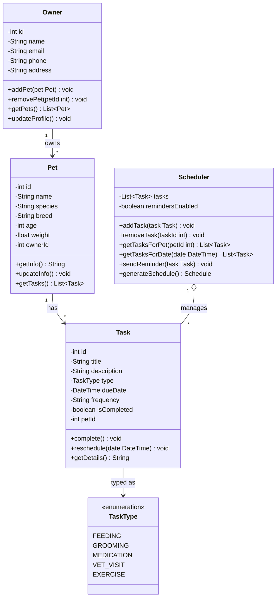

# PawPal+ Class Diagram

```mermaid
classDiagram
    class Owner {
        -int id
        -String name
        -String email
        -String phone
        -String address
        +addPet(pet Pet) void
        +removePet(petId int) void
        +getPets() List~Pet~
        +updateProfile() void
    }

    class Pet {
        -int id
        -String name
        -String species
        -String breed
        -int age
        -float weight
        -int ownerId
        +getInfo() String
        +updateInfo() void
        +getTasks() List~Task~
    }

    class Task {
        -int id
        -String title
        -String description
        -TaskType type
        -DateTime dueDate
        -String frequency
        -boolean isCompleted
        -int petId
        +complete() void
        +reschedule(date DateTime) void
        +getDetails() String
    }

    class TaskType {
        <<enumeration>>
        FEEDING
        GROOMING
        MEDICATION
        VET_VISIT
        EXERCISE
    }

    class Scheduler {
        -List~Task~ tasks
        -boolean remindersEnabled
        +addTask(task Task) void
        +removeTask(taskId int) void
        +getTasksForPet(petId int) List~Task~
        +getTasksForDate(date DateTime) List~Task~
        +sendReminder(task Task) void
        +generateSchedule() Schedule
    }

    Owner "1" --> "*" Pet : owns
    Pet "1" --> "*" Task : has
    Scheduler "1" o-- "*" Task : manages
    Task --> TaskType : typed as
```
