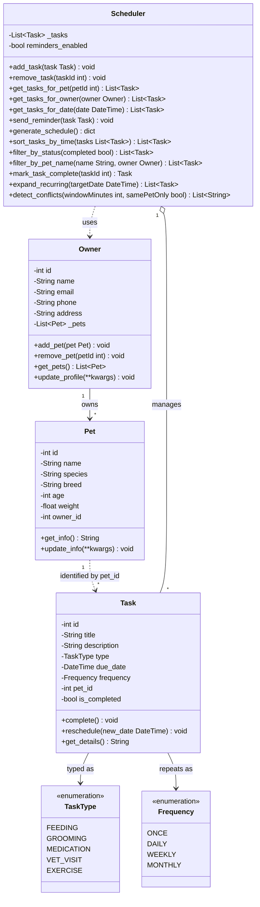

# PawPal+ Final Class Diagram

```mermaid
classDiagram
    class Owner {
        -int id
        -String name
        -String email
        -String phone
        -String address
        -List~Pet~ _pets
        +add_pet(pet Pet) void
        +remove_pet(petId int) void
        +get_pets() List~Pet~
        +update_profile(**kwargs) void
    }

    class Pet {
        -int id
        -String name
        -String species
        -String breed
        -int age
        -float weight
        -int owner_id
        +get_info() String
        +update_info(**kwargs) void
    }

    class Task {
        -int id
        -String title
        -String description
        -TaskType type
        -DateTime due_date
        -Frequency frequency
        -int pet_id
        -bool is_completed
        +complete() void
        +reschedule(new_date DateTime) void
        +get_details() String
    }

    class TaskType {
        <<enumeration>>
        FEEDING
        GROOMING
        MEDICATION
        VET_VISIT
        EXERCISE
    }

    class Frequency {
        <<enumeration>>
        ONCE
        DAILY
        WEEKLY
        MONTHLY
    }

    class Scheduler {
        -List~Task~ _tasks
        -bool reminders_enabled
        +add_task(task Task) void
        +remove_task(taskId int) void
        +get_tasks_for_pet(petId int) List~Task~
        +get_tasks_for_owner(owner Owner) List~Task~
        +get_tasks_for_date(date DateTime) List~Task~
        +send_reminder(task Task) void
        +generate_schedule() dict
        +sort_tasks_by_time(tasks List~Task~) List~Task~
        +filter_by_status(completed bool) List~Task~
        +filter_by_pet_name(name String, owner Owner) List~Task~
        +mark_task_complete(taskId int) Task
        +expand_recurring(targetDate DateTime) List~Task~
        +detect_conflicts(windowMinutes int, samePetOnly bool) List~String~
    }

    Owner "1" --> "*" Pet : owns
    Pet "1" ..> "*" Task : identified by pet_id
    Scheduler "1" o-- "*" Task : manages
    Scheduler ..> Owner : uses
    Task --> TaskType : typed as
    Task --> Frequency : repeats as
```
